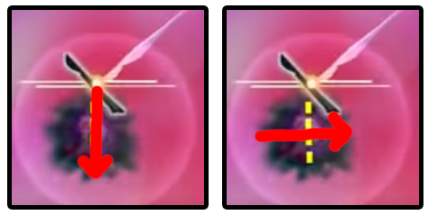
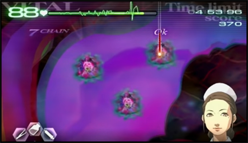

# Chapter 1 - Dr. Stiles

## Quick Links and Summary

* [Episode 1 - Standard Procedure](#ep1)
* [Episode 2 - Learning the Ropes](#ep2)
* [Episode 3 - A Farewell](#ep3)
* [Episode 5 - Singing the Blues](#ep5)
* [Episode 6 - A Real Doctor](#ep6)
* [Episode 8 - Life or Death](#ep8)
* [Episode Z - From Overseas](#epZ)

Please write some interesting stuff here!

This webpage is a work in progress. If you have any feedback, please join our community's discord server by clicking [here](https://discord.gg/h4qwmkY). If you want to view this project on github, please click [here](https://github.com/TraumaCenterSpeedruns/guides).

## <a id="ep1"></a>Episode 1 - Standard Procedure

* Just suture and remove the glass shards - it's not rocket science
* Try to memorize when and for how long Mary interrupts you with tutorial stuff
* You are required to disinfect the incision area before applying the bandage

This is the first operation in the game, and acts as a tutorial for the basic tools and techniques you will be using throughout the run. It really is as basic as suturing some stuff and removing glass shards.

One thing you need to be aware of when doing this operation is Mary's interruptions, as soon as you finish an action. Try to memorize when she will halt gameplay to talk, and how long each pause takes so you can resume operating. This is relevant since the game does NOT buffer A presses for some cases, so you may think you've begun suturing when in reality you've done nothing, since your A press was "eaten" by Mary talking.

A special note here that you are required to disinfect the bandage here, since it is part of the tutorial. This is the only episode where you HAVE to do it, at least for the "any rank" categories.

#### Special Notes for XS

* Must get at least 1 COOL glass shard
* GOOD suture or BAD glass shard is generally a reset

You do not have access to the stabilizer yet, so your score is entirely up to how fast and accurate you are with your actions. You should be getting a COOL for every incision and suture, but glass shards can be very finicky. You do not lose many points for getting a GOOD glass shard (only 20), so don't fret if you miss a few.

Keep in mind though, you drop 90 points for a GOOD suture or a BAD glass shard, and those might ruin your XS if you're not really fast. It is not worth it to try and regain your points by spamming gel, just reset the run. Also, keep in mind the 6 COOLs requirement - you need at least 1 COOL glass shard, so make sure you memorize the direction you should be extracting them in.

#### Scoring Information

| Grades | B | A | S | XS |
| :--: | :--: | :--: | :--: | :--: |
| Required score | 4900 | 5100 | 5200 | 5400 |

| Bonus | Score |
| :---: | :---: |
| No mistakes | 1000 |
| Vitals stayed above 75 | 500 |
| Finished with 4:35 left | 300 |
| 6 COOLs | 200 |

* Vitals start at 80/99
* Time limit: 5 minutes
* Score breakdown, assuming all COOLs:
  * 2 Lacerations: 280 points
  * 5 Glass Shards: 700 points
  * 1 Incision: 200 points
  * 1 Incision Suture: 240 points
  * 1 Bandage: 260 points

Adding up all the bonuses and score obtainable in the stage, we reach a max score of 3680 points, which will be added to the time and vital bonus to get the final grade. Therefore, assuming we get all COOLs, we can safely finish the operation in 25 seconds with 69 vitals remaining to guarantee the XS. For every second we go faster, we can go 1 vital lower:

```3680 + (69*5) + (275*5) = 5400```

## <a id="ep2"></a>Episode 2 - Learning the Ropes

* Use a full syringe for the stabilizer tutorial
* You must use the ultrasound on this tumor - memorize where you should aim

The second operation continues the tutorial trend and teaches you about the stabilizer and about tumors. There really isn't much to this one, inject the thing and extract the other thing and you win. Remember that from this operation onwards you no longer need to disinfect the incision area before applying the bandage, and you can save 2-4 seconds if you just go for the BAD.

Two small things to keep in mind: you NEED a full syringe injection to get past Mary's stabilizer tutorial, don't try to cheap out on her; you also MUST ultrasound the tumor in this operation, so memorize where it is and aim the ultrasound right at its center - if you hit it on the side Mary may not be fully pleased.

Another thing about cutting tumors: make sure you're slashing them **all the way**. Imagining the tumor as a circle, the game expects you to begin cutting from anywhere in the border and slash diametrically, as seen by the guideline. It is not very strict about this, but keep this in mind if you're having trouble slashing it up consistently. A small diagram since words can be confusing:



#### Special Notes for XS

* Just get all 3 COOLs, if you feel like you're slow pump the vitals up

There really aren't any tricks for this one - just play normally and get all 3 COOLs. If you're fast enough you don't even need to pump vitals in, but if you feel like you took too long, boosting vitals to 99 should guarantee an easy XS.

#### Scoring Information

| Grades | B | A | S | XS |
| :--: | :--: | :--: | :--: | :--: |
| Required score | 4100 | 4300 | 4500 | 4700 |

| Bonus | Score |
| :---: | :---: |
| No mistakes | 1000 |
| Finished with 4:20 left | 300 |
| 3 COOLs | 700 |

* Vitals start at 99/99
* Time limit: 5 minutes
* Score breakdown, assuming all COOLs:
  * 1 Tumor: 250 - 300 [\*]
  * 1 Incision: 80 - 200
  * 1 Incision Suture: 90 - 240
  * 1 Bandage: 100 - 260

[\*] You can only get a GOOD grade on this tumor

Adding up all the bonuses and score obtainable in the stage, we reach a max score of 3000 points, which will be added to the time and vital bonus to get the final grade. Therefore, assuming we get all COOLs, we can safely finish the operation in 40 seconds with 80 vitals remaining to guarantee the XS. For every second we go faster, we can go 1 vital lower:

```3000 + (80*5) + (260*5) = 4700```

## <a id="ep3"></a>Episode 3 - A Farewell

* Pretty much 1-2 but with 3 tumors, memorize where they are
* Skip the ultrasound to save time, you're memorizing the locations anyway
* Minimize tool switching if you're fast enough at cutting all 3 tumors

The third operation is pretty much a review of the previous one, now with 3 tumors instead of 1, and 2 small inflammations for you to take care of. Their hitboxes are deceptively small, so be extra careful when aiming - missing doesn't cost much time but it still costs time! The tumors are treated exactly like before.

One optimization you can make here is to skip the ultrasound entirely - just memorize where the tumors are and slash away. Be careful though, you should lift the scalpel before moving from one tumor to the next, the game is a bit janky with moving the scalpel over big distances. Here is a screenshot of the three exposed tumors so you can build your own visual cues of where to cut:



Lastly, to optimize your tool switching, you should be cutting all 3 tumors, then draining all 3, excising all 3, and then removing all 3 together. Since tool switching is essentially free in this game (compared to the DS, at least), this doesn't quite save time RTA (it does in the TAS!), so try it out and see what works for you. Keep in mind that you need to be fast enough to excise all 3 tumors before the cytoplasm regenerates if you're using this approach.

#### Special Notes for XS

* Pretty much the any rank strat, memorize the tumors to avoid ultrasound
* Be careful with the membrane hitbox, kinda janky
* Can go for the BAD bandage if you're fast enough

There isn't much difference here from how you would play without caring for rank. You should be a bit careful with extracting tumors and placing membranes, the hitboxes can be kinda jank and you can't afford a miss here. Getting the COOLs on the tumors is not required for XS, you only need 3 after all, but the score boost is much appreciated.

One optimization you can go for here is to skip the COOL bandage. This will cost you 160 points, but if you can clear the operation fast enough you will have enough points to just meet the XS requirement.

The time limit for this strat is to finish the operation in under 59 in-game seconds at 99 vitals at the end. For every vital we are missing though, we reduce our time limit by 1 second, so if you're at around 60 vitals you have 20 seconds to clear the operation, which is more than possible with enough practice.

To aid in this quest to optimize the bandage, we have a very small amount of down time between applying gel at the 3 tumor injuries and Mary calling the operation over. You can use this down time to inject about 2/3 of a full syringe of stabilizer into the patient, healing around 10 vitals. This can help your score enough where this strategy can be viable.

#### Scoring Information

| Grades | B | A | S | XS |
| :--: | :--: | :--: | :--: | :--: |
| Required score | 4100 | 4700 | 5100 | 5400 |

| Bonus | Score |
| :---: | :---: |
| No mistakes | 1000 |
| Finished with 4:00 left | 300 |
| 3 COOLs | 700 |

* Vitals start at 99/99
* Time limit: 5 minutes
* Score breakdown, assuming all COOLs:
  * 2 Inflammations: 80
  * 3 Tumors: 750 - 1080
  * 1 Incision: 80 - 200
  * 1 Incision Suture: 90 - 240
  * 1 Bandage: 100 - 260

Adding up all the bonuses and score obtainable in the stage, we reach a max score of 3860 points, which will be added to the time and vital bonus to get the final grade. Therefore, assuming we get all COOLs, we can safely finish the operation in 60 seconds with 68 vitals remaining to guarantee the XS. For every second we go faster, we can go 1 vital lower:

```3860 + (68*5) + (240*5) = 5400```
