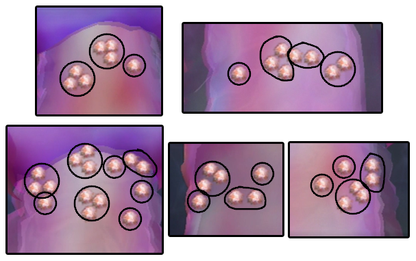
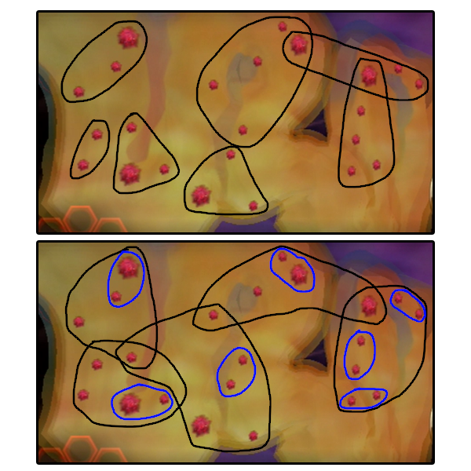
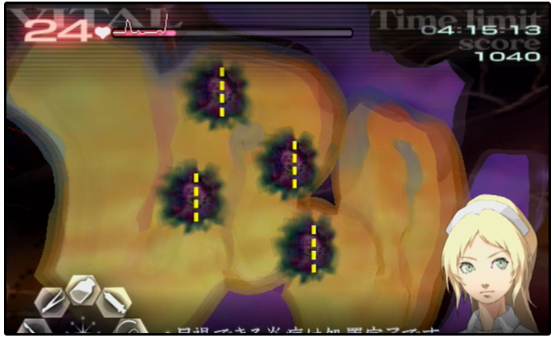

# Chapter 1 - Dr. Stiles

## Quick Links and Summary

* [Episode 1 - Standard Procedure](#ep1)
* [Episode 2 - Learning the Ropes](#ep2)
* [Episode 3 - A Farewell](#ep3)
* [Episode 5 - Singing the Blues](#ep5)
* [Episode 6 - A Real Doctor](#ep6)
* [Episode 8 - Life or Death](#ep8)
* [Episode Z - From Overseas](#epZ)

Please write some interesting stuff here!

This webpage is a work in progress. If you have any feedback, please join our community's discord server by clicking [here](https://discord.gg/h4qwmkY). If you want to view this project on github, please click [here](https://github.com/TraumaCenterSpeedruns/guides).

## <a id="ep1"></a>Episode 1 - Standard Procedure

* Just suture and remove the glass shards - it's not rocket science
* Try to memorize when and for how long Mary interrupts you with tutorial stuff
* You are required to disinfect the incision area before applying the bandage

This is the first operation in the game, and acts as a tutorial for the basic tools and techniques you will be using throughout the run. It really is as basic as suturing some stuff and removing glass shards.

One thing you need to be aware of when doing this operation is Mary's interruptions, as soon as you finish an action. Try to memorize when she will halt gameplay to talk, and how long each pause takes so you can resume operating. This is relevant since the game does NOT buffer A presses for some cases, so you may think you've begun suturing when in reality you've done nothing, since your A press was "eaten" by Mary talking.

A special note here that you are required to disinfect the bandage here, since it is part of the tutorial. This is the only episode where you HAVE to do it, at least for the "any rank" categories.

#### Special Notes for XS

* Must get at least 1 COOL glass shard
* GOOD suture or BAD glass shard is generally a reset

You do not have access to the stabilizer yet, so your score is entirely up to how fast and accurate you are with your actions. You should be getting a COOL for every incision and suture, but glass shards can be very finicky. You do not lose many points for getting a GOOD glass shard (only 20), so don't fret if you miss a few.

Keep in mind though, you drop 90 points for a GOOD suture or a BAD glass shard, and those might ruin your XS if you're not really fast. It is not worth it to try and regain your points by spamming gel, just reset the run. Also, keep in mind the 6 COOLs requirement - you need at least 1 COOL glass shard, so make sure you memorize the direction you should be extracting them in.

#### Scoring Information

| Grades | B | A | S | XS |
| :--: | :--: | :--: | :--: | :--: |
| Required score | 4900 | 5100 | 5200 | 5400 |

| Bonus | Score |
| :---: | :---: |
| No mistakes | 1000 |
| Vitals stayed above 75 | 500 |
| Finished with 4:35 left | 300 |
| 6 COOLs | 200 |

* Vitals start at 80/99
* Time limit: 5 minutes
* Score breakdown, assuming all COOLs:
  * 2 Lacerations: 280 points
  * 5 Glass Shards: 700 points
  * 1 Incision: 200 points
  * 1 Incision Suture: 240 points
  * 1 Bandage: 260 points

Adding up all the bonuses and score obtainable in the stage, we reach a max score of 3680 points, which will be added to the time and vital bonus to get the final grade. Therefore, assuming we get all COOLs, we can safely finish the operation in 25 seconds with 69 vitals remaining to guarantee the XS. For every second we go faster, we can go 1 vital lower:

```3680 + (69*5) + (275*5) = 5400```

## <a id="ep2"></a>Episode 2 - Learning the Ropes

* Use a full syringe for the stabilizer tutorial
* You must use the ultrasound on this tumor - memorize where you should aim

The second operation continues the tutorial trend and teaches you about the stabilizer and about tumors. There really isn't much to this one, inject the thing and extract the other thing and you win. Remember that from this operation onwards you no longer need to disinfect the incision area before applying the bandage, and you can save 2-4 seconds if you just go for the BAD.

Two small things to keep in mind: you NEED a full syringe injection to get past Mary's stabilizer tutorial, don't try to cheap out on her; you also MUST ultrasound the tumor in this operation, so memorize where it is and aim the ultrasound right at its center - if you hit it on the side Mary may not be fully pleased.

Another thing about cutting tumors: make sure you're slashing them **all the way**. Imagining the tumor as a circle, the game expects you to begin cutting from anywhere in the border and slash diametrically, as seen by the guideline. It is not very strict about this, but keep this in mind if you're having trouble slashing it up consistently. A small diagram since words can be confusing:


#### Special Notes for XS

* Just get all 3 COOLs, if you feel like you're slow pump the vitals up

There really aren't any tricks for this one - just play normally and get all 3 COOLs. If you're fast enough you don't even need to pump vitals in, but if you feel like you took too long, boosting vitals to 99 should guarantee an easy XS.

#### Scoring Information

| Grades | B | A | S | XS |
| :--: | :--: | :--: | :--: | :--: |
| Required score | 4100 | 4300 | 4500 | 4700 |

| Bonus | Score |
| :---: | :---: |
| No mistakes | 1000 |
| Finished with 4:20 left | 300 |
| 3 COOLs | 700 |

* Vitals start at 99/99
* Time limit: 5 minutes
* Score breakdown, assuming all COOLs:
  * 1 Tumor: 300 points [\*]
  * 1 Incision: 200 points
  * 1 Incision Suture: 240 points
  * 1 Bandage: 260 points

[\*] You can only get a GOOD grade on this tumor

Adding up all the bonuses and score obtainable in the stage, we reach a max score of 3000 points, which will be added to the time and vital bonus to get the final grade. Therefore, assuming we get all COOLs, we can safely finish the operation in 40 seconds with 80 vitals remaining to guarantee the XS. For every second we go faster, we can go 1 vital lower:

```3000 + (80*5) + (260*5) = 4700```

## <a id="ep3"></a>Episode 3 - A Farewell

* Pretty much 1-2 but with 3 tumors, memorize where they are
* Skip the ultrasound to save time, you're memorizing the locations anyway
* Minimize tool switching if you're fast enough at cutting all 3 tumors

The third operation is pretty much a review of the previous one, now with 3 tumors instead of 1, and 2 small inflammations for you to take care of. Their hitboxes are deceptively small, so be extra careful when aiming - missing doesn't cost much time but it still costs time! The tumors are treated exactly like before.

One optimization you can make here is to skip the ultrasound entirely - just memorize where the tumors are and slash away. Be careful though, you should lift the scalpel before moving from one tumor to the next, the game is a bit janky with moving the scalpel over big distances. Here is a screenshot of the three exposed tumors so you can build your own visual cues of where to cut:


Lastly, to optimize your tool switching, you should be cutting all 3 tumors, then draining all 3, excising all 3, and then removing all 3 together. Since tool switching is essentially free in this game (compared to the DS, at least), this doesn't quite save time RTA (it does in the TAS!), so try it out and see what works for you. Keep in mind that you need to be fast enough to excise all 3 tumors before the cytoplasm regenerates if you're using this approach.

#### Special Notes for XS

* Pretty much the any rank strat, memorize the tumors to avoid ultrasound
* Be careful with the membrane hitbox, kinda janky
* Can go for the BAD bandage if you're fast enough

There isn't much difference here from how you would play without caring for rank. You should be a bit careful with extracting tumors and placing membranes, the hitboxes can be kinda jank and you can't afford a miss here. Getting the COOLs on the tumors is not required for XS, you only need 3 after all, but the score boost is much appreciated.

One optimization you can go for here is to skip the COOL bandage. This will cost you 160 points, but if you can clear the operation fast enough you will have enough points to just meet the XS requirement.

The time limit for this strat is to finish the operation in under 59 in-game seconds at 99 vitals at the end. For every vital we are missing though, we reduce our time limit by 1 second, so if you're at around 60 vitals you have 20 seconds to clear the operation, which is more than possible with enough practice.

To aid in this quest to optimize the bandage, we have a very small amount of down time between applying gel at the 3 tumor injuries and Mary calling the operation over. You can use this down time to inject about 2/3 of a full syringe of stabilizer into the patient, healing around 10 vitals. This can help your score enough where this strategy can be viable.

#### Scoring Information

| Grades | B | A | S | XS |
| :--: | :--: | :--: | :--: | :--: |
| Required score | 4100 | 4700 | 5100 | 5400 |

| Bonus | Score |
| :---: | :---: |
| No mistakes | 1000 |
| Finished with 4:00 left | 300 |
| 3 COOLs | 700 |

* Vitals start at 99/99
* Time limit: 5 minutes
* Score breakdown, assuming all COOLs:
  * 2 Inflammations: 80 points
  * 3 Tumors: 1080 points
  * 1 Incision: 200 points
  * 1 Incision Suture: 240 points
  * 1 Bandage: 260 points

Adding up all the bonuses and score obtainable in the stage, we reach a max score of 3860 points, which will be added to the time and vital bonus to get the final grade. Therefore, assuming we get all COOLs, we can safely finish the operation in 60 seconds with 68 vitals remaining to guarantee the XS. For every second we go faster, we can go 1 vital lower:

```3860 + (68*5) + (240*5) = 5400```

## <a id="ep5"></a>Episode 5 - Singing the Blues

* Burn multiple polyps at the same time for max efficiency
* There is a scripted blood pool after the 4th polyp
* Waves alternate between top and bottom parts, zoom preemptively!

This operation is very straightforward, think of it as a tutorial for magnification and laser. There are a total of 5 polyp waves, that alternate between the top and bottom part of the throat. Just zoom in, drain the blood, laser the things, and apply the gel.

One thing to keep in mind here: the hitbox for each polyp is slightly larger than the graphics, so you can aim just between two polyps that are close to each other and kill them in groups. Try to get a feel for how long it takes to burn the polyps, so that you dont waste frames lasering something that is already dead, or have to jump back to a previous position because you moved too soon.

Another small detail, there is a scripted blood pool after you burn your 4th polyp, so anticipate it and switch tools as necessary!

You might think it is better to coat the affected area in gel before or during your lasering, so that the gel sticks immediately once you finish burning, which would be correct, if not for the fact that the gel gets in the way of you seeing where to aim, but if you're confident you can experiment with very fast tool switching to try and get that instant gel. Just keep in mind the gel is almost instantaneous as well if you apply it directly on top of the wound.

Below are the groupings used for lasering polyps together, for each wave:



#### Special Notes for XS

* Same as any rank, just get all 3 COOLs
* No need to worry about the vitals

The procedure is exactly the same as the any rank version, just be careful to make sure you get a COOL incision, suture and bandage, since that is one of the bonus requirements. There is no need to care for vitals, unless you are incredibly slow.

#### Scoring Information

| Grades | B | A | S | XS |
| :--: | :--: | :--: | :--: | :--: |
| Required score | 4200 | 4600 | 5000 | 5200 |

| Bonus | Score |
| :---: | :---: |
| No mistakes | 1000 |
| Less than 6 blood pools | 500 |
| Finished with 3:30 left | 300 |
| 3 COOLs | 200 |

* Vitals start at 99/99
* Time limit: 5 minutes
* Score breakdown, assuming all COOLs:
  * 44 Polyps: 880 points
  * 1 Incision: 200 points
  * 1 Incision Suture: 240 points
  * 1 Bandage: 260 points

Adding up all the bonuses and score obtainable in the stage, we reach a max score of 3580 points, which will be added to the time and vital bonus to get the final grade. Therefore, assuming we get all COOLs, we can safely finish the operation in 75 seconds with 99 vitals remaining to guarantee the XS. For every second we go faster, we can go 1 vital lower:

```3580 + (99*5) + (225*5) = 5200```

## <a id="ep6"></a>Episode 6 - A Real Doctor

* Keep an eye on the vitals and build an intuition for which value is safe and which isn't
* Make the most of your blue stuff when treating inflammations, avoid trips to the vial
* Slash tumors in groups of 2 and treat them all at once to be optimal
* Don't forget to spam ultrasound after treating all 4 tumors

This is the first operation with a real threat to the player, but still nothing to panic over. There are 4 tumors and 23 inflammations, and you should be treating all the inflammations before moving on to extracting the tumors. Remember from 1-3 how small these hitboxes can be, and aim carefully! Getting too many misses here can result in enough vital damage that you will need to boost vitals at some point.

The first step is taking care of the inflammations. Vitals will be plummeting as you do this, so try to work fast and efficient. The key here is minimizing the amount of trips to the vial, keeping in mind it's fine to run out of blue stuff while treating an inflammation.

The optimal way to achieve this is includes 7 trips to the vial, taking a FULL syringe with you on every trip. You can see the suggested groups to treat in the top diagram below. Note the intersections between groups - don't waste any blue stuff, inject on inflammations even if you cant fully treat them!



The bottom diagram shows a very advanced optimization with only 5 trips to the vial, exploiting the fact that the inflammation hitboxes extend beyond the graphic, and even intersect at some points. Because of this, you can damage two inflammations at once if you aim just right where their hitbox intersects - this takes a lot of practice and intuition to pull off, since you have no clear visual cues. You can see the suggested overlaps and new groupings in blue and black, respectively.

The tumors are lined up with the middle part of the intestine, you can see a picture below with their ultrasound locations so you can build your visual cues. One thing to note here when slashing them with the scalpel - you can open multiple tumors in one single slash! So what is recommended is to do two vertical incisions, one for the two tumors on the left, one for the two tumors on the right, just angle each cut a bit.



Extracting the tumors is the same procedure from 1-3, but here we have the vitals to worry about. Since you likely took some damage during the inflammation treatment, it helps to know how many vital points should be considered "safe" before you start treating the tumors. If you are below that safe value, inject the stabilizer until you're above it, to avoid having the patient die while removing the tumors and patching them up.

You can kinda reduce the dps you take by treating tumors one at a time, but that is not optimal from a tool switching perspective. Doesn't lose much time though, so stick to whatever feels comfortable for you. Keep in mind as well that what is a "safe" threshold for one runner could be dangerous for another, since this will vary based on how fast a runner is (faster = less damage taken) and how safe they want to play the operation (how comfortable are you seeing a patient at 0 vitals?).

For reference, at a high level you would want at least 30 vitals going into the tumor treatment. 35\~40 should be safe if you're playing it safer or slower. After extracting the tumors, you must spam the ultrasound for a while to make Angie shut up.

#### Special Notes for Hard

* Same treatment as Normal, but you will take considerably more damage
* Mistakes are more costly, so play a bit safer if you're not confident

The treatment is the same but you will be hard pressed for vitals once you finish the inflammations part. Extracting the tumors without boosting vitals WILL result in patient death. You must boost vitals to a "safe" value, and just like Normal, that threshold will vary for everyone - experiment and find something that works for you, and take mistakes into account, you don't want to die to an accidental tumor drop.

As a reference, at high levels of play you would consider at least 50 vitals, which allows some breathing room for a single mistake. Values closer to 60 and 65 are recommended if you're not fast at extracting the tumors, or maybe you can consider the approach of extracting tumors individually.

#### Special Notes for XS

* Mistakes are not allowed, be VERY careful with the syringe
* Add 25\~30 to what you considered "safe" for Hard, to account for the bonus
* Use the downtime after treating tumor 4 to pump vitals
* You can go for a BAD bandage if you're just a bit fast

This will be your first major hurdle in an XS run. The first obvious thing to point out is that mistakes are not allowed, so don't be too daring with the syringe, avoid aiming for hitbox intersections and play safely. Remember: it's faster to slow down than to reset the operation. If your vitals are nearing 30 while treating inflammations, inject some stabilizer asap to avoid the risk of vitals dipping below 25.

For the tumors, you want to experiment one more time with what shall be considered safe. You cannot go below 25 vitals, so consider spending a lot of time boosting vitals before tackling tumors, and even treating them individually if you're not confident in your speed.

At a very high level, 65 vitals just barely make it. Consider going to 70\~75 for safer strats, and if that's still not enough, treat tumors separately, and inject stabilizer as needed. It is not worth it to overheal past 75 since the vitals cap at 80, and you will take less dps as you remove tumors.

After removing the 4th tumor, you get some downtime before Angie tells you to spam the ultrasound. You have enough time here to do 2 full stabilizer injections, boosting your vitals (and thus your score) by a lot. Going for the COOL bandage should be a guaranteed XS if you managed to get every bonus.

One final optimization: getting a BAD bandage. Since we get so many points in this operation, this should be extremely free. I'd guess they didnt account for players getting COOLs on the tumors? If you're somehow missing XS because of the BAD bandage, you should probably be grinding this operation a bit more so you pick up the speed for the rest of the run, you will need it.

#### Scoring Information

| Grades | B | A | S | XS |
| :--: | :--: | :--: | :--: | :--: |
| Required score | 5000 | 5500 | 6000 | 6300 |

| Bonus | Score |
| :---: | :---: |
| No mistakes | 1000 |
| Vitals stayed above 25 | 500 |
| Finished with 3:30 left | 300 |
| 3 COOLs | 200 |

* Vitals start at 70/80
* Time limit: 5 minutes
* Score breakdown, assuming all COOLs:
  * 23 Inflammations: 920 points
  * 4 Tumors: 1440 points
  * 1 Incision: 200 points
  * 1 Incision Suture: 240 points
  * 1 Bandage: 260 points

Adding up all the bonuses and score obtainable in the stage, we reach a max score of 5060 points, which will be added to the time and vital bonus to get the final grade. Therefore, assuming we get all COOLs, we can safely finish the operation in 90 seconds with 38 vitals remaining to guarantee the XS. For every second we go faster, we can go 1 vital lower:

```5060 + (38*5) + (210*5) = 6300```

## <a id="ep8"></a>Episode 8 - Life or Death

* The operation starts with a defibrilator use
* There is a scripted defibrilator use after extracting the small glass shards
* Practice the defibrilator so you at least hit the light gray area consistently

This operation starts off with the defibrilator tutorial, so be ready to move your wiimote closer to the screen. Practice your timing so you can consistently hit at least the light gray area - the gauge might be fast but it should be 100% consistent if you build a nice visual cue.

The procedure itself is extremely straightforward, just some suturing and glass shard removal. Think of it as a revisit to 1-1 but with the defibrilator and Angie screaming at you. There will be a second scripted use of the defibrilator after you remove all of the glass shards, so be ready for that.

The only thing that can trip you up here is getting too many glass shard misses when extracting them. Remember that going too fast is pointless if your accuracy drops dramatically!

#### Special Notes for XS

* No need to worry about vitals, they will always be at max when you finish
* You can only miss 2 COOL grades to get the XS
* Getting a BAD on the big glass shard is an instant reset
* It is possible (but hard) to recover from a BAD on a small glass shard

This operation is considerable more annoying when going for XS, only because getting COOLs removing glass shards is not the most consistent thing to do. You are only allowed to miss 2 COOL grades, so be careful when extracting the glass shards - move perfectly perpendicular to the wound!

The procedure itself is exactly the same, there's no need to alter your sequencing or even worry about vitals, since they get automatically boosted to 30 after the auto HT proc. Your only concern here should be time and COOL count.

While there is no chain requirement, getting a BAD can be fatal for XS, since you lose 90 points for a small glass shard and a whopping 230 for the big one, effectively shortening your time limit by 18 and 46 seconds respectively. While it is possible to recover from a small glass shard's BAD if you're super fast, getting a BAD on the big one will be an automatic reset - you would need to be superhuman to finish the operation in time. ~~Yes this is a challenge~~

#### Scoring Information

| Grades | B | A | S | XS |
| :--: | :--: | :--: | :--: | :--: |
| Required score | 4900 | 5300 | 5800 | 6000 |

| Bonus | Score |
| :---: | :---: |
| No mistakes | 1000 |
| Finished with 4:00 left | 300 |
| 10 COOLs | 700 |

* Vitals start at 10/30
* Time limit: 5 minutes
* Score breakdown, assuming all COOLs:
  * 6 Lacerations: 840 points
  * 6 Glass Shards: 840 points
  * 1 Big Glass Shard: 260 points
  * 1 Incision: 200 points
  * 1 Incision Suture: 240 points
  * 1 Bandage: 260 points

Adding up all the bonuses and score obtainable in the stage, we reach a max score of 4640 points, which will be added to the time and vital bonus to get the final grade. Therefore, assuming we get all COOLs, we can safely finish the operation in 58 seconds with 30 vitals remaining to guarantee the XS. For every second we go faster, we can go 1 vital lower:

```4640 + (30*5) + (242*5) = 6000```

## <a id="epZ"></a>Episode Z - From Overseas

* asd

asd

#### Special Notes for XS

* asd

asd

#### Scoring Information

| Grades | B | A | S | XS |
| :--: | :--: | :--: | :--: | :--: |
| Required score | 4000 | 4700 | 5100 | 5400 |

| Bonus | Score |
| :---: | :---: |
| No mistakes | 700 |
| Chain over 28 | 300 |
| Finished with 3:45 left | 500 |
| 3 COOLs | 500 |

* Vitals start at 80/99
* Time limit: 5 minutes
* Score breakdown, assuming all COOLs:
  * 1 Small Cut: 30 points
  * 5 Bone Fragments: 200 points
  * 1 Bone Reposition: 100 points
  * 1 Bone Cut: 30 points
  * 6 Bone Placements: 360 points
  * 6 Bone Gels: 240 points
  * 1 Incision: 200 points
  * 1 Incision Suture: 240 points
  * 1 Bandage: 260 points

Adding up all the bonuses and score obtainable in the stage, we reach a max score of 3660 points, which will be added to the time and vital bonus to get the final grade. Therefore, assuming we get all COOLs, we can safely finish the operation in 58 seconds with 30 vitals remaining to guarantee the XS. For every second we go faster, we can go 1 vital lower:

```3660 + (99*5) + (249*5) = 5400```
